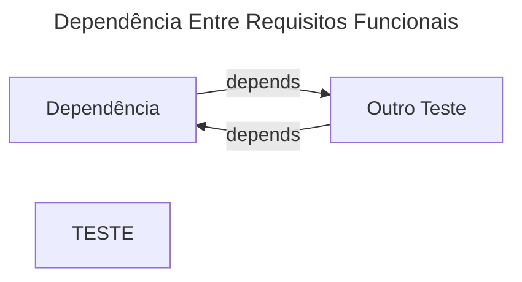
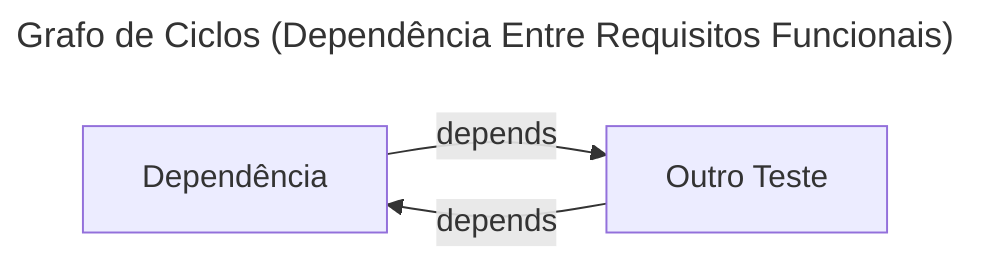

# Requisitos Funcionais

Tabela 1: Requisitos Funcionais do Módulo

|ID|Nome|Descrição|Dependências|Prioridade|
|-|-|-|-|-|
|RF0|Dependência|Mais uma descrição|RF1|Baixa|
|RF1|Outro Teste|Outra descrição|RF0|Média|
|RF2|TESTE|Feito para Teste||ALTA|

Autor: Autoria Própria

# Requisitos Não Funcionais

Tabela 2: Requisitos Não Funcionais do Módulo

|ID|Nome|Descrição|
|-|-|-|
|RNF0|Teste|Mais um TESTE PQP|

Autor: Autoria Própria

# Regras de Negócio

Tabela 3: Regras de Negócio do Módulo

|ID|Nome|Descrição|
|-|-|-|
|RN0|Test|Não pode dar merda né!|

Autor: Autoria Própria

# Grafo de Dependências

Grafo de Fluxo 1: Grafo esquematizado das dependências entre os requisitos funcionais

Fonte: Autoria Própria

# Ciclo entre dependências

Grafo de Fluxo 2: Grafo que contém um dos ciclos encontrados no grafo ${this.name}

Fonte: Autoria Própria

